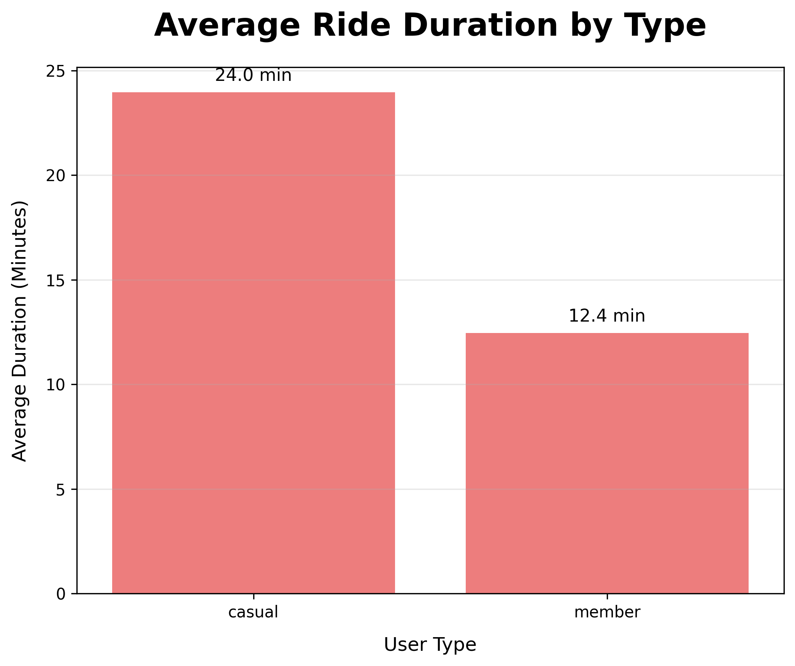
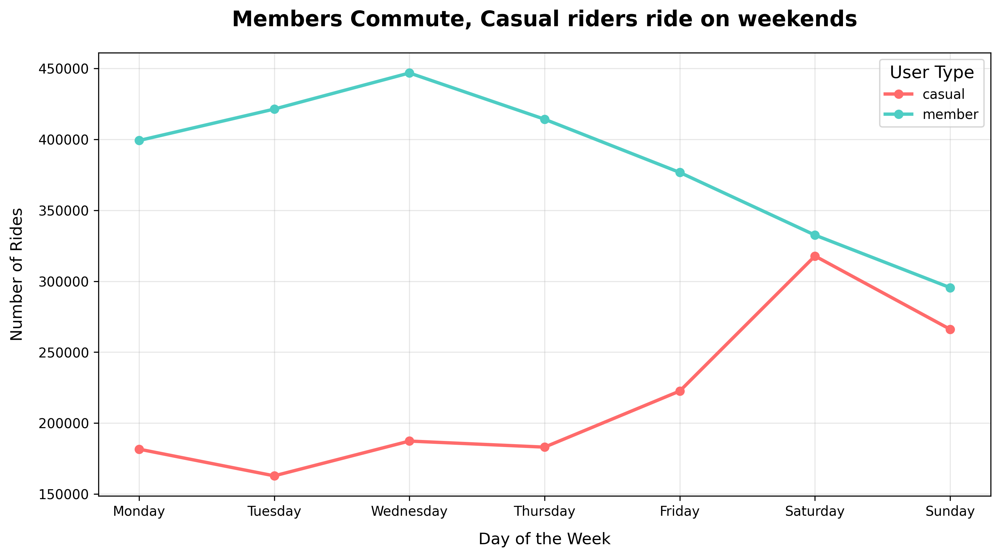
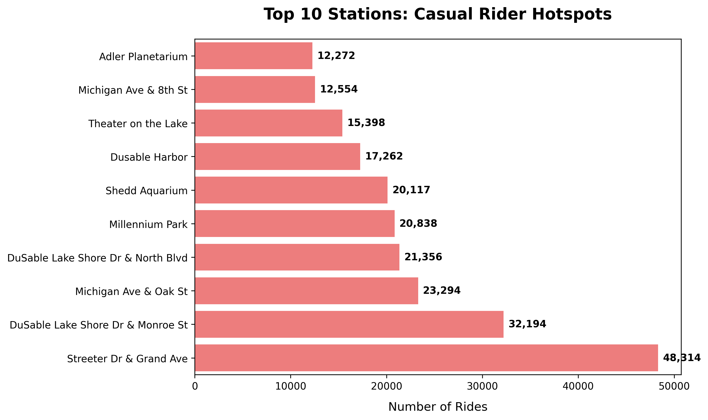
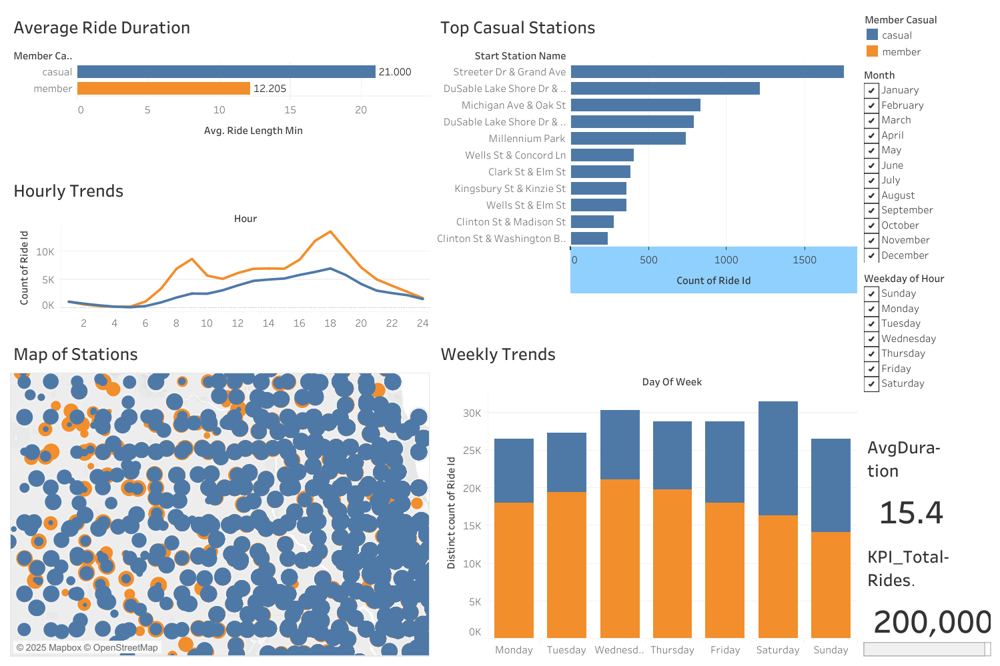

# Cyclistic Bike-Share Analysis
📌 This project is available across platforms:  
- [Interactive Tableau Dashboard](https://public.tableau.com/views/CyclisticBike-ShareAnalysis2024/CyclisticBike-ShareAnalysis2024?:language=en-US&:sid=&:redirect=auth&:display_count=n&:origin=viz_share_link)  
- [Story-driven Kaggle Notebook](https://www.kaggle.com/code/rummanaslam/cyclistic-bike-share-from-data-to-strategy)  
- [Full Code & Repo (GitHub)](https://github.com/Uman-66/Cyclytics-Bikes-Data-analysis)
O
## 📑 Table of Contents
1. [Business Task](#-1-business-task)
2. [Stakeholders](#-2-stakeholders)
3. [Data Source](#-3-data-source)
4. [Repository Structure](#-4-repository-structure)
5. [Tools & Technologies](#-5-tools--technologies)
6. [Process](#-6-process)
7. [Analysis & Key Findings](#-7-analysis--key-findings)
8. [Visualizations & Dashboard](#-8-visualizations--dashboard)
9. [Strategic Recommendations](#-9-strategic-recommendations)
11. [Kaggle Notebook](#-11-kaggle-notebook)


## 🎯 1. Business Task

The goal of this analysis is to identify **how annual members and casual riders use Cyclistic bikes differently**. By analyzing behavioral patterns from the complete 2024 trip data, this project will provide actionable insights to guide the marketing team's strategy for converting casual riders into annual members, thereby driving future growth.

**Key Questions to Explore:**

* How do ride durations differ between members and casual riders?
* What are the patterns in ride volume by day of the week and time of day for each group?
* Which stations are most popular for casual riders, and how does this compare to members?
* Does bike type (classic, docked, electric) preference vary between the two groups?

## 👥 2. Stakeholders

* **Lily Moreno:** Director of Marketing (Primary stakeholder)
* **Cyclistic Marketing Analytics Team**
* **Cyclistic Executive Team** (Will approve the final strategy)

## 📊 3. Data Source

This analysis uses the most recent 12 months of Cyclistic trip data (Jan-Dec 2024).

* **Source:** [Divvy Trip Data](https://divvy-tripdata.s3.amazonaws.com/index.html)
* **License:** Data provided by Motivate International Inc. under this [license](https://ride.divvybikes.com/data-license-agreement).
* **Privacy:** All personally identifiable information has been removed. Analysis focuses solely on aggregate behavioral patterns.

## 🗂️ 4. Repository Structure

```
cyclistic-bikeshare-analysis/
│
├── data/
│   ├── raw/       # Original, unaltered source CSV files (12 files)
│   └── clean/     # Processed data in Parquet format & SQL database
│
├── notebooks/     # Jupyter notebooks for the analysis process
│   ├── 01_data_cleaning.ipynb
│   ├── 02_sql_analysis.ipynb
│   └── 03_visualization.ipynb
│
|
│
├── outputs/
│   ├── tables/    # Exported summary tables (CSV)
│   └── figures/   # Exported visualizations (PNG)
│
├── data_cleaning_log.md # Summary of data cleaning steps & changes
└── README.md            # Project overview (this file)
```

## 🔧 5. Tools & Technologies

* **Data Processing & Cleaning:** Python (Pandas, NumPy)
* **Database & Analysis:** SQLite, SQL
* **Visualization:** Python (Matplotlib, Seaborn), Tableau Public
* **Version Control & Documentation:** Git, GitHub, Markdown

## 🔄 6. Process

The analysis will follow the six steps of the data analysis process: **Ask, Prepare, Process, Analyze, Share, and Act.**

1. **Ask:** Define the business task and key questions. *(Complete)*
2. **Prepare:** Identify and download data; set up the project structure. *(Complete)*
3. **Process:** Clean and transform the data for analysis. This includes:

   * Combining 12 monthly files into a single dataset.
   * Calculating new columns (ride\_length, day\_of\_week, month, etc.).
   * Filtering out invalid data (negative times, rides >24 hours).
   * Documenting all cleaning steps in a log.
   * Loading the clean data into an SQL database for analysis.
4. **Analyze:** Use SQL and Python to perform exploratory data analysis (EDA) and identify trends.
5. **Share:** Create visualizations and build a dashboard to communicate findings.
6. **Act:** Provide top three data-driven recommendations for the marketing strategy.

---
## 📊 7. Analysis & Key Findings

The analysis phase involved running targeted SQL queries on the cleaned database to answer the core business questions. The following key insights were uncovered:

**1. Ride Duration:**
- Casual riders take **50% longer** trips on average (24 minutes) compared to members (12 minutes), indicating a leisure-oriented usage pattern.

**2. Weekly Patterns:**
- **Members** show consistent, high usage throughout the **weekdays** (M-F), characteristic of commuting.
- **Casual** ridership spikes significantly on **weekends** (Sat-Sun), confirming use for leisure activities.

**3. Daily Patterns:**
- Member traffic shows distinct **rush hour peaks** at 7-8 AM and 4-6 PM.
- Casual ridership builds gradually, peaking in the **early afternoon** (2-4 PM).

**4. Geographic Trends:**
- The top 10 stations for casual riders are overwhelmingly concentrated around **Chicago's major tourist and recreational attractions** (e.g., Navy Pier, Millennium Park, Shedd Aquarium, Adler Planetarium).

## 📈 8. Visualizations & Dashboard

The analysis was translated into the following visualizations to drive strategic decision-making. Each chart is paired with its core business implication.

**Key Visualizations:**

1.  **Average Ride Duration by User Type**
    *   **Insight:** Casual riders take 50% longer trips.
    *   **Business Implication:** Their use case is leisure, not commute. Marketing should frame the annual membership as a key to unlimited exploration and savings on recreational rides.
    *   

2.  **Rides by Day of the Week**
    *   **Insight:** Member usage is consistent on weekdays; Casual usage spikes on weekends.
    *   **Business Implication:** Digital ad campaigns and promotions targeting casual riders should be heavily concentrated from Thursday to Saturday to capture them when they are most active.
    *   

3.  **Top Start Stations for Casual Riders**
    *   **Insight:** Usage is highly concentrated at tourist and recreational hubs.
    *   **Business Implication:** This provides a crystal-clear targeting list for physical marketing efforts (on-bike signage, station posters, local partnerships) to achieve the highest possible conversion rate.
    *   
   4. Interactive Tableau Dashboard

   *    

    For a deeper exploration of the trends, view the live dashboard here:  
[View on Tableau Public](https://public.tableau.com/views/CyclisticBike-ShareAnalysis2024/CyclisticBike-ShareAnalysis2024?:language=en-US&:sid=&:redirect=auth&:display_count=n&:origin=viz_share_link)

**Interactive Tableau Dashboard:**
For a deeper exploration of the trends, an interactive dashboard was created.
[](https://public.tableau.com/app/profile/yourname/viz/YourDashboardName) <!-- REPLACE WITH YOUR LINK -->

*All generated figures are available in the `/outputs/figures/` directory.*
*These findings were exported to CSV files for further visualization and are available in the `/outputs/tables/` directory.*
*This project is part of the Google Data Analytics Professional Certificate. Cyclistic is a fictional company, but the data has been made available by Motivate International Inc.*
## ✅ 9. Strategic Recommendations

Based on the analysis, the following targeted initiatives are recommended to convert casual riders into members:

| Initiative | Supporting Insight | Action |
| :--- | :--- | :--- |
| **Tourist Hub Conversion** | Casual riders’ top stations are tourist attractions (e.g., Streeter Dr & Grand Ave, Millennium Park) | Place promotional kiosks/signage at these hotspots offering a “Weekender Pass” convertible into an annual membership |
| **Targeted Digital Campaign** | Consistent casual ridership on Thu/Fri afternoons suggests commute intent | Run ads in Chicago business districts during these times with a free 1-week trial |
| **E-Bike Loyalty Program** | Casual riders use e-bikes disproportionately compared to members | Launch an app feature: *“10 e-bike rides unlocks 25% off membership”* |
## 🔗 11. Kaggle Notebook

For a story-driven version of this analysis, I published a Kaggle notebook that walks through the problem, data prep, insights, and recommendations in a recruiter-friendly format:

[](https://www.kaggle.com/code/rummanaslam/cyclistic-bike-share-from-data-to-strategy)
